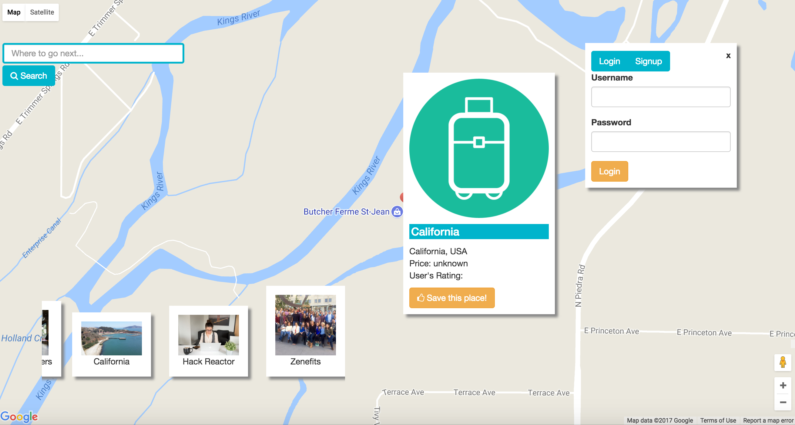

# Where Next?

### User Stories and Motivation:
- Travelers often times do not know where to go in a new city. How can we help someone to quickly find places around San Francisco and beyond? Enter [**Where Next**](https://wherenxt.herokuapp.com/). This platform enables someone to browse for places without the need to create a Yelp/Google account. This will feature places with user ratings, average cost(where applicable) and a few other features.
- The motivation behind this is to create an easy and seamless user experience without the need to create complicated profiles and login services.

Link: https://wherenxt.herokuapp.com/

### Steps to start:
1. **yarn install** to get all dependencies
2. **yarn start** to start the app on port 3000 (Go to http://localhost:3000)
    You should see:
    *Where Next is listening on port 3001!*
    *redis connect*
3. **yarn nodemon** (if nodemon is installed) otherwise yarn server to start Node.JS server on port 3001 (Go to http://localhost:3001)
4. **yarn run build** to generate build pack
4. Happy coding!

**Quick Note:** You will need to provide a .env file with dependencies.
- REACT_APP_REDIS=YOUR REDIS DB
- REACT_APP_URL=http://localhost:3001

### Dependencies:
- React (made with create-react-app)
- prop-types
- Express.JS (node version 8.1.4)
- body-parser
- dotenv
- redis

### Overview:
- Quick and responsive UI components built with React and Bootstrap
- Node.JS with Express for a lightweight back end server
- dotenv to load environment-specific variables
- redis as in-memory, database storage solution

### Things can be improved:
- Social logins
- Integration with other APIs (Yelp)
